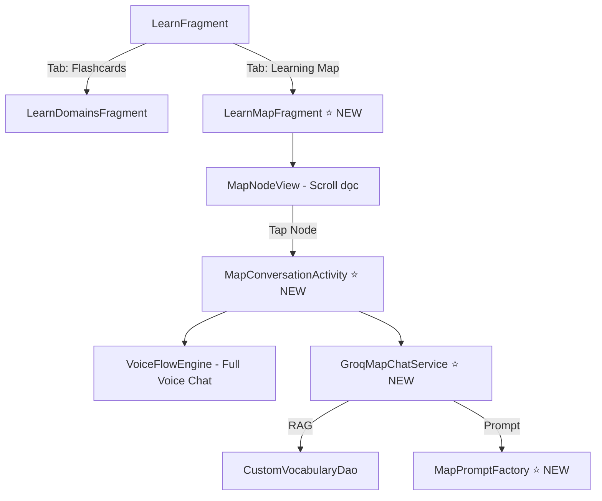
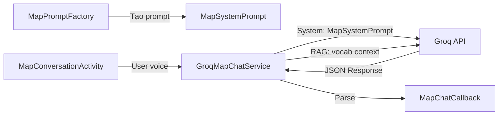

# 🗺️ EnglishFlow — Learning Map Feature Design

## Tổng Quan Kiến Trúc

Tính năng **Learning Map** (Bản đồ học tập) — một hành trình học tập dạng scroll dọc theo các "trạm" (stations), nơi người dùng trò chuyện hoàn toàn bằng **voice** với AI Flow về từng chủ đề cụ thể.



---

## 1. Cấu Trúc MAP — Hành Trình Học Tập

### 1.1 Khái Niệm

Lấy cảm hứng từ **Learna AI**, mỗi map là một **hành trình scroll dọc** với các "trạm" (node) nối bằng đường cong. Mỗi trạm có chủ đề riêng, người dùng tap vào để bắt đầu hội thoại voice với AI.

### 1.2 Danh Sách Các Map (Journeys)

| # | Map ID | Tên Map | Icon | Mô tả | Số Trạm |
|---|--------|---------|------|--------|---------|
| 1 | `greetings` | Chào hỏi & Gặp gỡ | 👋 | Học cách chào hỏi, tạm biệt, hỏi thăm sức khỏe | 6 |
| 2 | `introductions` | Giới thiệu bản thân | 🙋 | Tự giới thiệu tên, tuổi, nghề nghiệp, sở thích | 6 |
| 3 | `daily_life` | Đời sống hằng ngày | 🏠 | Mô tả thói quen, hoạt động, thời gian biểu | 7 |
| 4 | `food_drinks` | Ăn uống & Nhà hàng | 🍽️ | Gọi món, mô tả đồ ăn, thanh toán | 7 |
| 5 | `shopping` | Mua sắm | 🛍️ | Hỏi giá, kích cỡ, màu sắc, trả giá | 6 |
| 6 | `travel` | Du lịch & Đi lại | ✈️ | Đặt vé, hỏi đường, khách sạn, tham quan | 8 |
| 7 | `work_office` | Công sở & Nghề nghiệp | 💼 | Phỏng vấn, email, họp, thuyết trình | 7 |
| 8 | `health` | Sức khỏe & Bệnh viện | 🏥 | Triệu chứng, khám bệnh, thuốc men | 6 |
| 9 | `emotions` | Cảm xúc & Tâm trạng | 💝 | Diễn tả cảm xúc, chia sẻ tâm sự | 6 |
| 10 | `advanced_debate` | Tranh luận & Ý kiến | 🎤 | Đưa ra quan điểm, phản biện, thuyết phục | 7 |

### 1.3 Cấu Trúc Mỗi Trạm (Node)

```java
// MapNode.java — Data Model
public class MapNode {
    private String nodeId;          // "greetings_01"
    private String title;           // "Hello & Hi"
    private String subtitle;        // "Cách chào hỏi cơ bản"
    private String emoji;           // "😊"
    private int colorAccent;        // 0xFF4CAF50
    private NodeStatus status;      // LOCKED, AVAILABLE, IN_PROGRESS, COMPLETED
    private String promptKey;       // Key để lấy prompt từ MapPromptFactory
    private int xpReward;           // XP thưởng khi hoàn thành (15-30)
    private int minExchanges;       // Số lượt hội thoại tối thiểu để hoàn thành (3-5)
}

enum NodeStatus {
    LOCKED,       // 🔒 Chưa mở khóa (node trước chưa hoàn thành)
    AVAILABLE,    // 🟢 Sẵn sàng để học
    IN_PROGRESS,  // 🔵 Đang học dở
    COMPLETED     // ✅ Đã hoàn thành
}
```

---

## 2. Thiết Kế UI — Premium Map View

### 2.1 Fragment Mới: `LearnMapFragment`

Giao diện chính hiển thị bản đồ scroll dọc với các node.

```
┌──────────────────────────────────────┐
│         🗺️ Hành Trình Học Tập        │  ← Header gradient
│     "Trò chuyện với AI để luyện      │
│      phát âm & giao tiếp"           │
├──────────────────────────────────────┤
│                                      │
│         👋 (Gradient Circle)         │  ← Node 1: COMPLETED ✅
│       "Chào hỏi cơ bản"             │
│              │                       │
│           ╱  ╲  (Đường nối cong)     │
│              │                       │
│    🤝 (Gradient Circle)             │  ← Node 2: AVAILABLE 🟢
│  "Chào hỏi trang trọng"             │
│              │                       │
│           ╲  ╱                       │
│              │                       │
│    🌅 (Gradient Circle, mờ)         │  ← Node 3: LOCKED 🔒
│  "Chào theo thời điểm"              │
│              │                       │
│           ╱  ╲                       │
│              │                       │
│    📱 (Gradient Circle, mờ)         │  ← Node 4: LOCKED 🔒
│  "Chào qua điện thoại"              │
│              │                       │
│     ↓  (Scroll indicator)            │
│                                      │
└──────────────────────────────────────┘
```

### 2.2 Thiết Kế Map Node (Custom View: `MapNodeView`)

Mỗi node là một **gradient circle** (70dp) với:
- **Outer ring glow** khi AVAILABLE (pulse animation)
- **Check icon overlay** khi COMPLETED
- **Lock icon overlay** khi LOCKED (opacity 0.4)
- **Progress ring** khi IN_PROGRESS (partial arc)
- **Đường nối**: Bezier curve (`Path`) giữa các node, xen kẽ trái/phải

### 2.3 Map Conversation Activity

Khi tap vào node → mở **MapConversationActivity** — giao diện full-screen voice chat:

```
┌──────────────────────────────────────┐
│  ← Back   "Chào hỏi cơ bản"  🎯 3/5│  ← Toolbar + Progress
├──────────────────────────────────────┤
│                                      │
│         ┌──────────────────┐         │
│         │                  │         │
│         │   AI Avatar      │         │  ← Animated AI Avatar
│         │   (Lottie/Wave)  │         │     (Breathing animation)
│         │                  │         │
│         └──────────────────┘         │
│                                      │
│    "Xin chào! Tôi là Flow.          │  ← AI Speech Bubble
│     Hãy thử giới thiệu              │     (Fade-in animation)
│     bản thân bằng tiếng Anh!"       │
│                                      │
│    ┌─ Gợi ý ───────────────┐        │  ← Suggestion chips
│    │ "Hello, my name is..." │        │     (Tap để nghe phát âm)
│    │ "Nice to meet you"     │        │
│    └────────────────────────┘        │
│                                      │
│              ┌──────┐                │
│              │  🎤  │                │  ← Large mic button
│              │      │                │     (Pulse when listening)
│              └──────┘                │
│        "Nhấn để nói"                 │
│                                      │
└──────────────────────────────────────┘
```

---

## 3. Hệ Thống Prompt RAG — Phân Luồng Chi Tiết

### 3.1 Kiến Trúc Prompt



> [!IMPORTANT]
> Prompt tính năng Map **TÁCH BIỆT HOÀN TOÀN** với System Prompt chính (`SYSTEM_PROMPT` trong `GroqChatService.java`). 
> - System Prompt chính → Chat tự do (tab Chat)
> - Map Prompt → Hướng dẫn theo kịch bản học tập cụ thể (tab Learning Map)

### 3.2 Prompt Tổng (Meta Prompt) — `MAP_BASE_PROMPT`

Đây là prompt nền tảng dùng chung cho **TẤT CẢ** map node, đặt ra vai trò & quy tắc cơ bản:

```java
// MapPromptFactory.java
public static final String MAP_BASE_PROMPT = 
    "Bạn là Flow — một Gia sư Tiếng Anh-Việt chuyên dạy qua HÌNH THỨC HỘI THOẠI VOICE.\n\n" +
    
    "QUY TẮC VOICE CONVERSATION:\n" +
    "1. Câu trả lời PHẢI NGẮN GỌN (tối đa 2-3 câu). Vì đây là hội thoại voice, " +
    "người dùng NGHE chứ không ĐỌC — nên tránh dài dòng.\n" +
    "2. Luôn KHEN NGỢI trước khi sửa lỗi. Ví dụ: 'Great job! Phát âm tốt lắm! " +
    "Chỉ cần lưu ý: ...'.\n" +
    "3. Khi sửa phát âm, viết CÁCH ĐỌC ra chữ (ví dụ: 'Hello đọc là HEH-loh, " +
    "không phải hê-lô').\n" +
    "4. Luôn ĐẶT CÂU HỎI ở cuối mỗi lượt để duy trì hội thoại.\n" +
    "5. Nếu người dùng nói tiếng Việt, nhẹ nhàng khuyến khích chuyển sang tiếng Anh.\n" +
    "6. KHÔNG sử dụng emoji, ký tự đặc biệt (✿☁⚡) hoặc markdown (**bold**) vì " +
    "nội dung sẽ được đọc bằng TTS.\n\n" +
    
    "FORMAT JSON RESPONSE:\n" +
    "{\n" +
    "  \"response\": \"Nội dung phản hồi ngắn gọn\",\n" +
    "  \"pronunciation_tip\": \"Gợi ý phát âm nếu có, hoặc rỗng\",\n" +
    "  \"score\": 0-10 (đánh giá câu trả lời: 0=chưa trả lời, " +
    "5=hiểu nhưng nhiều lỗi, 8=tốt, 10=hoàn hảo),\n" +
    "  \"is_complete\": false (true nếu node này có thể kết thúc)\n" +
    "}";
```

### 3.3 Prompt Riêng Từng Map Node — Chi Tiết

Mỗi map có prompt **riêng biệt**, được append sau `MAP_BASE_PROMPT`:

---

#### **Map 1: Chào hỏi & Gặp gỡ** (`greetings`)

| Node | Prompt Key | Prompt Nội Dung |
|------|-----------|-----------------|
| 1.1 | `greetings_basic` | `"CHỦ ĐỀ: Chào hỏi cơ bản (Hello, Hi, Hey). KỊCH BẢN: Bạn gặp người dùng lần đầu ở quán cà phê. Hãy chào hỏi và hướng dẫn họ cách chào lại. Bắt đầu bằng 'Hello! Nice to meet you! Can you say Hello back to me?'. Sau khi họ chào, hỏi tên họ."` |
| 1.2 | `greetings_formal` | `"CHỦ ĐỀ: Chào hỏi trang trọng (Good morning/afternoon/evening). KỊCH BẢN: Bạn là tiếp tân tại khách sạn. Chào người dùng bằng 'Good morning, sir/madam!' và hỏi họ cần gì. Hướng dẫn phân biệt morning/afternoon/evening theo thời điểm."` |
| 1.3 | `greetings_time` | `"CHỦ ĐỀ: Chào theo thời điểm. KỊCH BẢN: Dạy người dùng cách chào phù hợp: trước 12h → Good morning, 12h-18h → Good afternoon, sau 18h → Good evening. Đặt tình huống khác nhau để họ luyện tập."` |
| 1.4 | `greetings_phone` | `"CHỦ ĐỀ: Chào qua điện thoại. KỊCH BẢN: Bạn gọi điện cho người dùng. Dạy cách nói 'Hello, this is [name] speaking' và 'May I speak to...'. Thực hành role-play gọi điện."` |
| 1.5 | `greetings_goodbye` | `"CHỦ ĐỀ: Tạm biệt. KỊCH BẢN: Sau buổi nói chuyện vui vẻ, dạy các cách tạm biệt: Goodbye, See you later, Take care, Have a nice day. Thực hành kết thúc hội thoại tự nhiên."` |
| 1.6 | `greetings_howru` | `"CHỦ ĐỀ: Hỏi thăm sức khỏe. KỊCH BẢN: Dạy 'How are you?' và các cách trả lời: I'm fine / I'm doing great / Not too bad. Luyện tập qua nhiều tình huống."` |

---

#### **Map 2: Giới thiệu bản thân** (`introductions`)

| Node | Prompt Key | Prompt Nội Dung |
|------|-----------|-----------------|
| 2.1 | `intro_name` | `"CHỦ ĐỀ: Giới thiệu tên. KỊCH BẢN: Bạn tham dự một buổi tiệc. Dạy người dùng nói 'My name is...' hoặc 'You can call me...'. Hỏi về tên họ và cách đánh vần."` |
| 2.2 | `intro_age_origin` | `"CHỦ ĐỀ: Tuổi và quê quán. KỊCH BẢN: Dạy cách nói 'I am X years old' và 'I am from Vietnam/Ho Chi Minh City'. Luyện tập hỏi đáp Where are you from?"` |
| 2.3 | `intro_job` | `"CHỦ ĐỀ: Nghề nghiệp. KỊCH BẢN: Dạy 'I work as a...' hoặc 'I am a student/teacher/engineer'. Đặt câu hỏi What do you do for a living? và các cách trả lời."` |
| 2.4 | `intro_hobbies` | `"CHỦ ĐỀ: Sở thích. KỊCH BẢN: Dạy 'I like/enjoy/love + V-ing'. Hỏi 'What do you like to do in your free time?' và giúp người dùng mô tả sở thích."` |
| 2.5 | `intro_family` | `"CHỦ ĐỀ: Gia đình. KỊCH BẢN: Dạy từ vựng gia đình (mother, father, sister, brother). Hỏi 'Tell me about your family' và hướng dẫn cách mô tả."` |
| 2.6 | `intro_full` | `"CHỦ ĐỀ: Giới thiệu hoàn chỉnh. KỊCH BẢN: Tổng hợp tất cả — yêu cầu người dùng tự giới thiệu hoàn chỉnh (tên, tuổi, quê, nghề, sở thích, gia đình) trong 1 đoạn. Đánh giá và gợi ý cải thiện."` |

---

#### **Map 3: Đời sống hằng ngày** (`daily_life`)

| Node | Prompt Key | Prompt Nội Dung |
|------|-----------|-----------------|
| 3.1 | `daily_morning` | `"CHỦ ĐỀ: Buổi sáng. KỊCH BẢN: Hỏi 'What do you usually do in the morning?'. Dạy: I wake up at..., I brush my teeth, I have breakfast. Luyện tập mô tả thói quen buổi sáng."` |
| 3.2 | `daily_time` | `"CHỦ ĐỀ: Nói giờ. KỊCH BẢN: Dạy cách nói giờ: It's 7 o'clock, half past 8, quarter to 9. Đặt quiz: 'What time is it?' với các thời điểm khác nhau."` |
| 3.3 | `daily_meals` | `"CHỦ ĐỀ: Bữa ăn trong ngày. KỊCH BẢN: Hỏi 'What do you usually have for breakfast/lunch/dinner?'. Dạy tên các bữa ăn và thực phẩm phổ biến."` |
| 3.4 | `daily_transport` | `"CHỦ ĐỀ: Đi lại. KỊCH BẢN: Hỏi 'How do you go to school/work?'. Dạy: by bus, by motorbike, on foot, by car. Luyện tập mô tả hành trình."` |
| 3.5 | `daily_weather` | `"CHỦ ĐỀ: Thời tiết. KỊCH BẢN: Hỏi 'How is the weather today?'. Dạy: sunny, rainy, cloudy, hot, cold. Luyện tập mô tả thời tiết và mặc đồ phù hợp."` |
| 3.6 | `daily_weekend` | `"CHỦ ĐỀ: Cuối tuần. KỊCH BẢN: Hỏi 'What do you do on weekends?'. Dạy cách mô tả hoạt động cuối tuần: go to the park, watch movies, meet friends."` |
| 3.7 | `daily_routine_full` | `"CHỦ ĐỀ: Một ngày hoàn chỉnh. KỊCH BẢN: Yêu cầu người dùng mô tả toàn bộ ngày từ sáng đến tối. Đánh giá và giúp cải thiện câu nói tự nhiên hơn."` |

---

#### **Map 4-10**: Tương tự pattern trên — mỗi node có prompt riêng biệt, tình huống role-play khác nhau.

### 3.4 RAG Pipeline cho Map

```java
// GroqMapChatService.java — Service RIÊNG cho Map Chat
public class GroqMapChatService {
    
    // KHÁC với GroqChatService ở 3 điểm:
    // 1. System prompt: MAP_BASE_PROMPT + node-specific prompt (KHÔNG DÙNG SYSTEM_PROMPT)
    // 2. Response format: Có thêm "score" và "is_complete" 
    // 3. Conversation history: Giữ lại context qua nhiều lượt (tối đa 10 messages)
    
    private final List<JsonObject> conversationHistory = new ArrayList<>();
    
    public void sendMessage(String userMessage, String nodePromptKey, 
                           List<CustomVocabularyEntity> ragContext,
                           MapChatCallback callback) {
        // 1. Build System Prompt = MAP_BASE_PROMPT + nodeSpecificPrompt
        String systemPrompt = MapPromptFactory.getPrompt(nodePromptKey);
        
        // 2. RAG: Inject relevant vocabulary vào system prompt
        if (ragContext != null && !ragContext.isEmpty()) {
            systemPrompt += "\n\nTỪ VỰNG THAM KHẢO (dùng tự nhiên trong hội thoại):\n";
            for (CustomVocabularyEntity v : ragContext) {
                systemPrompt += "- " + v.word + " /" + v.ipa + "/: " + v.meaning + "\n";
            }
        }
        
        // 3. Build message array WITH history
        // [system, ...history, user_new_message]
        
        // 4. Call Groq API
        // 5. Parse JSON → MapChatCallback
    }
}

public interface MapChatCallback {
    void onSuccess(String response, String pronunciationTip, int score, boolean isComplete);
    void onError(String error);
}
```

### 3.5 So Sánh RAG: Chat Tab vs Map Tab

| Đặc điểm | Chat Tab (hiện tại) | Map Tab (mới) |
|-----------|---------------------|----------------|
| **System Prompt** | `SYSTEM_PROMPT` (dài, đa năng) | `MAP_BASE_PROMPT` + node prompt (ngắn, chuyên biệt) |
| **RAG Source** | `searchRelevant(userMessage)` — tìm theo nội dung | `getVocabByDomain(nodeTheme)` — lấy theo chủ đề node |
| **Response Format** | `response, correction, vocab_word, ...` (7 fields) | `response, pronunciation_tip, score, is_complete` (4 fields) |
| **History** | Không giữ (mỗi request độc lập) | Giữ 10 messages gần nhất (ngữ cảnh hội thoại) |
| **Temperature** | 0.6 (sáng tạo vừa) | 0.7 (tự nhiên hơn cho voice) |
| **Max tokens** | 2500 | 500 (ngắn gọn cho voice) |
| **Interaction** | Text + Voice | **Voice only** (có gợi ý text) |

---

## 4. Cấu Trúc File Mới Cần Tạo

### 4.1 Data Layer

```
data/
├── MapJourney.java          // Model: danh sách map journeys
├── MapNode.java             // Model: từng node trong map
├── MapPromptFactory.java    // Factory: prompt cho từng node
├── GroqMapChatService.java  // Service: gọi Groq API cho map chat
└── MapProgressManager.java  // Manager: lưu/đọc tiến độ node
```

### 4.2 Database Layer

```
database/
├── entity/
│   └── MapProgressEntity.java   // Entity: tiến độ từng node
├── dao/
│   └── MapProgressDao.java      // DAO: CRUD tiến độ
└── EnglishFlowDatabase.java     // Cập nhật thêm entity + dao
```

### 4.3 UI Layer

```
ui/
├── fragments/
│   ├── LearnMapFragment.java        // Fragment: hiển thị map
│   └── LearnFragment.java           // Cập nhật: thêm tab
├── views/
│   └── MapPathView.java             // Custom View: vẽ đường nối
├── adapters/
│   └── MapNodeAdapter.java          // Adapter: RecyclerView cho nodes
└── MapConversationActivity.java     // Activity: voice chat với AI
```

### 4.4 Layout Files

```
res/layout/
├── fragment_learn_map.xml           // Layout map chính
├── item_map_node.xml                // Layout từng node
├── item_map_journey_header.xml      // Header cho mỗi journey
├── activity_map_conversation.xml    // Layout voice chat
└── fragment_learn.xml               // Cập nhật: thêm TabLayout
```

### 4.5 Drawable Resources

```
res/drawable/
├── bg_map_node_available.xml        // Gradient circle cho node sẵn sàng
├── bg_map_node_completed.xml        // Gradient circle + check cho node hoàn thành
├── bg_map_node_locked.xml           // Circle mờ cho node khóa
├── bg_map_node_progress.xml         // Circle với progress ring
├── bg_map_path.xml                  // Đường nối giữa các node
├── bg_map_header_gradient.xml       // Header gradient
├── bg_map_conversation.xml          // Background cho conversation
├── bg_map_mic_button.xml            // Nút mic lớn
├── bg_map_suggestion_chip.xml       // Chip gợi ý
└── bg_map_score_badge.xml           // Badge điểm
```

---

## 5. Flow Logic — Luồng Hoạt Động

### 5.1 Mở Map Tab

```
1. User tap tab "Học" → LearnFragment loads
2. LearnFragment hiển thị TabLayout: [📚 Flashcards] [🗺️ Hành trình]
3. Nếu chọn "Hành trình" → LearnMapFragment
4. LearnMapFragment load MapJourney list từ MapPromptFactory
5. Hiển thị RecyclerView scroll dọc với các nodes
6. Node đầu tiên mỗi journey = AVAILABLE, còn lại = LOCKED
7. Check MapProgressEntity → update status cho completed/in_progress nodes
```

### 5.2 Tap Vào Node

```
1. User tap node có status AVAILABLE hoặc IN_PROGRESS
2. Mở MapConversationActivity với Intent extras:
   - nodeId, title, subtitle, promptKey, minExchanges
3. Activity init:
   - GroqMapChatService
   - VoiceFlowEngine (clone từ ChatFragment nhưng auto-voice)
   - Load conversation history từ DB (nếu IN_PROGRESS)
4. AI tự động chào (dựa theo prompt của node)
5. AI đọc lời chào bằng TTS → chuyển sang LISTENING
6. User nói → STT → gửi API → AI trả lời → TTS → loop
```

### 5.3 Hoàn Thành Node

```
1. Sau mỗi lượt, API trả "score" và "is_complete"
2. Tích lũy exchanges count
3. Khi exchanges >= minExchanges VÀ is_complete == true:
   - Hiển thị celebration overlay
   - Cộng XP (xpReward)
   - Cập nhật MapProgressEntity → COMPLETED
   - Mở khóa node tiếp theo → AVAILABLE
   - Animation confetti + sound effect
4. Save progress → back to map → map auto-scrolls tới node mới
```

### 5.4 Scoring System

```
Mỗi node: Thu thập score trung bình từ các exchanges
- Average score >= 8: ⭐⭐⭐ (3 sao, +30 XP)
- Average score >= 6: ⭐⭐ (2 sao, +20 XP)
- Average score >= 3: ⭐ (1 sao, +15 XP)
- Average score < 3: Yêu cầu thử lại

Sao hiển thị trên node sau khi hoàn thành.
```

---

## 6. Thiết Kế UI Chi Tiết

### 6.1 Color Palette cho Map

```java
// Mỗi journey có bộ màu riêng
Map 1 (Chào hỏi):    Primary=#4CAF50, Accent=#81C784, Path=#E8F5E9
Map 2 (Giới thiệu):  Primary=#2196F3, Accent=#64B5F6, Path=#E3F2FD
Map 3 (Daily Life):   Primary=#FF9800, Accent=#FFB74D, Path=#FFF3E0
Map 4 (Food):         Primary=#F44336, Accent=#E57373, Path=#FFEBEE
Map 5 (Shopping):     Primary=#9C27B0, Accent=#BA68C8, Path=#F3E5F5
Map 6 (Travel):       Primary=#00BCD4, Accent=#4DD0E1, Path=#E0F7FA
Map 7 (Work):         Primary=#607D8B, Accent=#90A4AE, Path=#ECEFF1
Map 8 (Health):       Primary=#E91E63, Accent=#F06292, Path=#FCE4EC
Map 9 (Emotions):     Primary=#FF5722, Accent=#FF8A65, Path=#FBE9E7
Map 10 (Debate):      Primary=#795548, Accent=#A1887F, Path=#EFEBE9
```

### 6.2 Animation Specs

| Element | Animation | Duration | Easing |
|---------|-----------|----------|--------|
| Node glow (AVAILABLE) | Scale pulse 1.0→1.08→1.0 | 1500ms | EaseInOut |
| Path draw | Stroke dash animation | 800ms | Linear |
| Node tap | Scale 1.0→0.92→1.0 + ripple | 300ms | Overshoot |
| Mic button (LISTENING) | Scale pulse + color shift | 1000ms | EaseInOut |
| Score reveal | Fade in + scale up + bounce | 600ms | BounceOut |
| Star rating | Sequential fade+rotate per star | 300ms each | DecelerateInterpolator |
| Confetti | Particle system | 2000ms | Physics-based |

### 6.3 LearnFragment Tab Layout Cập Nhật

```xml
<!-- Thêm vào fragment_learn.xml -->
<LinearLayout android:orientation="vertical">
    
    <!-- Tab bar siêu mỏng, premium -->
    <com.google.android.material.tabs.TabLayout
        android:id="@+id/learnTabs"
        style="@style/MapTabStyle"
        android:layout_width="match_parent"
        android:layout_height="48dp"
        app:tabMode="fixed"
        app:tabGravity="fill"
        app:tabIndicatorColor="@color/ef_primary_green"
        app:tabIndicatorHeight="3dp"
        app:tabRippleColor="@color/ef_ripple_soft" />
    
    <!-- Container cho fragment con -->
    <FrameLayout
        android:id="@+id/learnContainer"
        android:layout_width="match_parent"
        android:layout_height="match_parent" />
        
</LinearLayout>
```

---

## 7. Database Schema Mới

### 7.1 MapProgressEntity

```java
@Entity(tableName = "map_progress")
public class MapProgressEntity {
    @PrimaryKey @NonNull
    public String nodeId;           // "greetings_01"
    
    public String userEmail;
    public String journeyId;        // "greetings"
    public String status;           // "LOCKED", "AVAILABLE", "IN_PROGRESS", "COMPLETED"
    public int starRating;          // 0-3
    public int totalScore;          // Sum of all exchange scores
    public int exchangeCount;       // Number of voice exchanges completed
    public long lastPlayedAt;       // Timestamp
    public long completedAt;        // Timestamp (0 if not completed)
}
```

### 7.2 MapConversationEntity (Optional — cho resume)

```java
@Entity(tableName = "map_conversations")
public class MapConversationEntity {
    @PrimaryKey(autoGenerate = true)
    public int id;
    
    public String nodeId;
    public String userEmail;
    public String role;             // "user" or "ai"
    public String content;
    public int score;               // Score cho exchange này (chỉ ai messages)
    public long timestamp;
}
```

---

## 8. Thứ Tự Triển Khai Đề Xuất

### Phase 1: Foundation (Nền tảng)
1. Tạo `MapNode.java`, `MapJourney.java` (data models)
2. Tạo `MapPromptFactory.java` (tất cả prompts)  
3. Tạo `MapProgressEntity` + `MapProgressDao` + cập nhật Database
4. Tạo `GroqMapChatService.java`
5. Tạo `MapProgressManager.java`

### Phase 2: Map UI
6. Cập nhật `fragment_learn.xml` → thêm TabLayout
7. Cập nhật `LearnFragment.java` → xử lý tab switching
8. Tạo `fragment_learn_map.xml` + `item_map_node.xml`
9. Tạo `MapNodeAdapter.java` + `MapPathView.java`
10. Tạo `LearnMapFragment.java`

### Phase 3: Conversation UI
11. Tạo `activity_map_conversation.xml`
12. Tạo `MapConversationActivity.java`
13. Integrate VoiceFlowEngine cho auto-voice mode
14. Implement scoring + completion logic

### Phase 4: Polish
15. Drawable resources (gradients, shapes)
16. Animations (node pulse, path draw, confetti)
17. Sound effects
18. Testing & bug fixes

---

> [!TIP]
> Bạn có thể yêu cầu tôi bắt tay vào triển khai từng Phase. Recommend bắt đầu từ **Phase 1** để có nền tảng vững chắc trước khi build UI.
